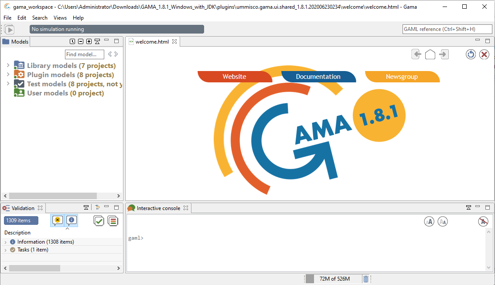
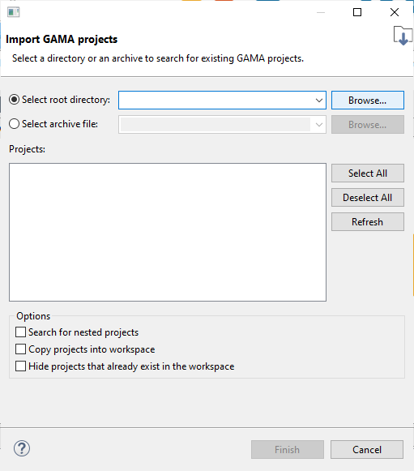
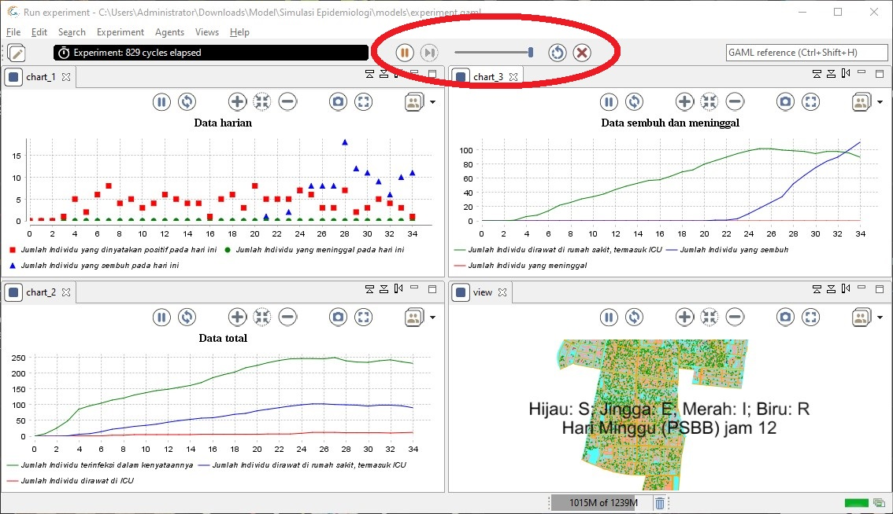

# Manual Pengguna

Untuk melakukan simulasi epidemiologi, diperlukan pemasangan aplikasi GAMA, serta beberapa prosedur yang dijelaskan pada dokumen ini.

- [Manual Pengguna](#Manual-Pengguna)
  - [Pemasangan Aplikasi GAMA](#Pemasangan-Aplikasi-GAMA)
    - [Kebutuhan Sistem](#Kebutuhan-Sistem)
    - [Mengunduh Aplikasi](#Mengunduh-Aplikasi)
    - [Mengunduh Model Simulasi](#Mengunduh-Model-Simulasi)
  - [Melakukan Simulasi pada GAMA](#Melakukan-simulasi-pada-gama)
    - [Meng-*import* Model Simulasi](#meng-import-model-simulasi)
    - [Menjalankan Simulasi](#Menjalankan-Simulasi)

## Pemasangan Aplikasi GAMA

### Kebutuhan Sistem

GAMA 1.8.1 termasuk Java JDK membutuhkan ruang penyimpanan sekitar 540 MB dan RAM sebesar minimal 4 GB. GAMA dapat dijalankan dari sistem operasi Windows, Linux, atau MacOS.

### Mengunduh Aplikasi

Aplikasi dapat diunduh dari https://gama-platform.github.io/download. Pengguna dapat mengunduh dengan memilih opsi "WITH JDK" sesuai dengan sistem operasi yang digunakan, sebagaimana ditunjukkan pada gambar 1. Berkas .zip akan diunduh ke komputer.

> Gambar 1. Tampilan laman web pengunduhan GAMA.

Kemudian, pengguna perlu untuk *extract* berkas .zip yang diunduh itu di direktori yang diinginkan.

> Gambar 2. Mengekstraksi berkas .zip yang berisi aplikasi GAMA.

Pengguna perlu membuka folder GAMA yang sudah di-*extract*. Kemudian membuka aplikasi GAMA, seperti pada gambar 3 berikut.

> Gambar 3. Tampilan folder GAMA yang sudah diekstraksi, serta aplikasi Gama.exe yang akan dibuka.

Pada penggunaan pertama aplikasi GAMA, pengguna akan diberikan opsi untuk menentukan letak folder GAMA Workspace yang akan dibuat. Folder tersebut merupakan direktori *default* untuk menyimpan model simulasi yang dibuat sendiri oleh pengguna. Biarkan opsi *default* dan tekan OK.

> Gambar 4. Opsi pengguna untuk menentukan letak GAMA Workspace. Gunakan saja opsi *default* dan klik OK sampai muncul tampilan jendela utama aplikasi GAMA.

Kemudian, akan ditampilkan jendela utama aplikasi GAMA.

> Gambar 5. Tampilan jendela utama aplikasi GAMA.

### Mengunduh Model Simulasi

Pengguna dapat mengunduh berkas model simulasi pada repository GitHub ini. Pengguna perlu untuk mengunduh kemudian mengekstraksi berkas .zip yang diunduh, pada direktori yang diinginkan. 

Setelah diekstraksi, akan terlihat bahwa terdapat folder bernama "Simulasi Epidemiologi".

## Melakukan Simulasi pada GAMA

### Meng-*import* Model Simulasi

Setelah ditampilkan jendela utama, langkah selanjutnya adalah meng-*import* model simulasi. Untuk melakukannya, pengguna perlu mengklik kanan pada bagian yang ditunjuk pada gambar 6. Kemudian, pilih "Import..." dan "GAMA Project...".

> Gambar 6. Tampilan setelah klik kanan pada bagian kiri jendela utama, di bawah "Library models", "Plugin models", "Test models", dan "User models".

Pada jendela yang muncul, pilih opsi "Select root directory:" dan klik "Browse".

> Gambar 7. Jendela yang muncul setelah "Import... > GAMA Project...".

Jendela untuk memilih direktori akan ditampilkan. Pengguna perlu untuk memilih folder model Simulasi Epidemiologi yang sebelumnya telah diunduh dan diekstraksi, dengan mengkliknya lalu klik "Select Folder". Setelah kembali ke jendela sebelumnya, pilih "Finish".

> Gambar 8. Tampilan folder Simulasi Epidemiologi yang perlu dipilih.

Pengguna mungkin perlu menunggu sebelum proses *import* selesai. Jika berhasil, maka akan muncul model Simulasi Epidemiologi pada bagian kiri jendela utama GAMA. Kemudian, klik dua kali pada teks tersebut dan klik dua kali pada teks "models", sehingga tampilan nampak seperti berikut pada gambar 9.

> Gambar 9. Tampilan jendela setelah *import* model simulasi.

### Menjalankan Simulasi

Pengguna perlu untuk mengklik dua kali pada "experiment.gaml" yang ditunjukkan pada kotak merah pada gambar 9. Tampilan jendela akan memperlihatkan kode program yang menyusun *file* model. Kemudian, tekan tombol hijau yang bertuliskan "Run experiment".

> Gambar 10. Tampilan isi dari berkas experiment.gaml. Lingkaran merah menunjukkan tombol untuk memulai simulasi.

Tunggu beberapa saat sementara model simulasi dipersiapkan oleh GAMA. Setelah selesai, pengguna akan dihadapkan pada jendela dialog seperti pada gambar 11.

>  Gambar 11. Dialog yang ditunjukkan sebelum simulasi berlangsung.

Akan terdapat 5 pertanyaan yang perlu dijawab pengguna:

- Jumlah individu yang terinfeksi di awal;
- Batas jumlah konfirmasi positif COVID-19 sehingga memicu diadakannya PSBB;
- Berapa hari terdapat penurunan kasus konfirmasi positif yang berturut-turut sehingga PSBB dilonggarkan menjadi *new normal*;
- Akurasi tes COVID-19 dalam persen (masukkan bilangan bulat); dan
- Efektivitas *contact-tracing* dalam persen (masukkan bilangan bulat).

Setelah kelima pertanyaan dijawab pengguna, simulasi akan berjalan secara otomatis. Tampilan jendela akan menjadi seperti berikut.

> Gambar 12. Tampilan utama simulasi yang berlangsung.  

Terdapat tiga grafik serta peta yang dapat diamati pengguna. Grafik-grafik tersebut terdiri dari grafik konfirmasi, kematian, dan kesembuhan per hari; grafik data sembuh dan meninggal; serta grafik data jumlah pasien di rumah sakit atau ICU.

Grafik yang terletak pada bagian kiri atas menunjukkan data harian jumlah individu yang terkonfirmasi positif COVID-19, meninggal karenanya, dan sembuh karenanya. Data yang ditunjukkan adalah data harian, sehingga individu yang sembuh yang ditunjukkan pada data suatu hari berbeda dengan individu yang sembuh di hari lainnya.

Grafik yang berada pada bagian kanan atas menunjukkan data total individu yang dirawat di rumah sakit (termasuk dirawat di ICU), individu yang sembuh, dan individu yang meninggal. Data yang ditunjukkan adalah data total, bukan perhari seperti grafik sebelumnya. Dengan kata lain, datanya merupakan akumulasi. Data ini di-*update* setiap 24 jam.

Grafik yang terakhir pada bagian kiri bawah menunjukkan data total individu yang terinfeksi, individu yang dirawat di rumah sakit (termasuk dirawat di ICU), dan individu yang dirawat di ICU. Grafik yang terakhir ini menunjukkan data total individu yang terinfeksi juga, yang berarti meliputi individu yang sudah tes (dan dirawat di rumah sakit) maupun individu yang belum dites. Dari grafik ini dapat diinterpretasikan rasio jumlah tes per infeksi, serta dapat diinterpretasikan pertumbuhan jumlah pasien rumah sakit. Data yang ditunjukkan juga data akumulasi, dan juga di-*update* setiap 24 jam.

Pengguna dapat melakukan *zoom-in* pada peta dengan menggunakan *scroll* *mouse* pada bagian peta di simulasi, bila diperlukan, atau dengan menekan tombol *maximize* pada peta. Gambar 13 berikut menunjukkan letak tombol *maximize* untuk masing-masing grafik atau peta.

> Gambar 13. Lingkaran untuk menunjukkan tombol *maximize* grafik atau peta.

Simulasi akan berhenti dengan sendirinya pada hari yang ditentukan pengguna. Tetapi, pengguna dapat juga menghentikan simulasi di tengah-tengah dengan menekan tombol X yang ada di bagian atas jendela simulasi.

> Gambar 14. Tombol-tombol pengatur simulasi terdapat pada bagian atas jendela.
